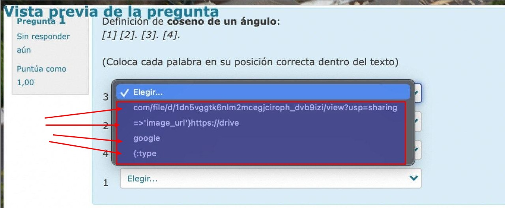

# Problema

Las imágenes está alojadas en Google Drive pero no se ven en las preguntas.

# 1. Descripción

Tengan cuidado antes de utilizar las preguntas hay algunas con errores. Cuando creo la pregunta, en el desplegable pone las siguientes opciones de respuesta:

Cuando le pasé el `asker check` me lo dió por bueno, pero no se de donde saca esto,
revisando creo que el error puede estar en el tema de la imagen asociada.

# 2. Solución

Al revisar el URL del mapa se puede ver que NO apunta a una imagen, apunta a otra cosa. Las URL de imágenes deben ser del estilo "http...png" o "http...jpg" o "http...jpeg".

Enlace de interés:

* [How to Make a Direct Download Link for Google Drive Files](https://www.howtogeek.com/747810/how-to-make-a-direct-download-link-for-google-drive-files/): How to Make a Direct Download Link for Google Drive Files
We’ve all come across that unwanted web page that opens when you click a Google Drive file link. Luckily, with a workaround, you can make a direct download link for your files and bypass that web.
