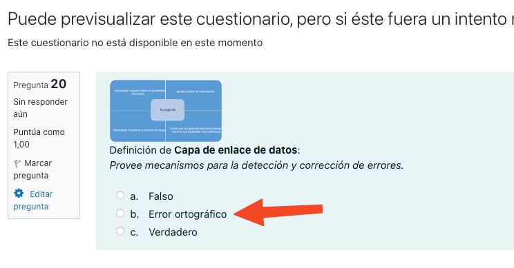

# Excluir "Errores ortograficos"

¿Por qué si en el `asker.ini` excluyo las respuestas con errores de ortografía, sigue metiendo la opción “Error ortográfico” en las posibles respuestas ?

Mi sistema es: macos 12.6 / ruby 3.1.2p20 / asker version 2.5.0



```
Definición de Capa de enlace de datos:
Provee mecanismos para la detección y corrección de errores.

(a) Falso
(b) Error ortográfico
(c) Verdadero
```
Gracias de antemano

## Solución

Actualizar a asker 2.5.1. Se ha corregido el bug.

## Descripción técnica

Es un bug de la versión 2.5.0 que se ha corregido en la 2.5.1.

El problema es que la pregunta con el código "d1true" era una pregunta de opción múltiple con: true, false y error ortográfico. Pero no se filtraba con asker.ini porque su nombre "d1true" no contenía misspelled.

## Solución técnica

Ahora tenemos los siguiente tipos de preguntas:
* "d1true", es boolean y lo correcto es el true
* "dttrue-misspelled" es de opción múltiple y lo correcto es true.
* "d1false", es boolean y lo correcto es el false
* "dtfalse-misspelled" es de opción múltiple y lo correcto es false.

Ahora se filtra correctamente por "misspelled" en el asker.ini.
