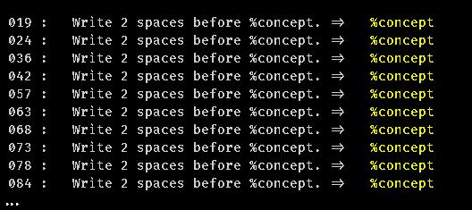

# Descripción del problema

[14/12/22]

Estoy teniendo este problema, pero las tabulaciones están bien. Me ha pasado ya en varios archivos



Lo curioso es que si quito todo lo que está en esas líneas , se desplaza el contenido hacia arriba y sigue apareciendo el error.

## Primeros pasos

Se solicita el [fichero haml](ficheros.problema/el_relieve.html) para chequearlo.
Lo copio en `ficheros.solucion/el_relieve2.haml` para no modificar el original.

```
❯ asker check ficheros.solucion/el_relieve2.haml

 020 :   Write 2 spaces before %concept. =>   %concept
 025 :   Write 2 spaces before %concept. =>   %concept
 037 :   Write 2 spaces before %concept. =>   %concept
 043 :   Write 2 spaces before %concept. =>   %concept
 058 :   Write 2 spaces before %concept. =>   %concept
 063 :   Write 2 spaces before %concept. =>   %concept
 068 :   Write 2 spaces before %concept. =>   %concept
 073 :   Write 2 spaces before %concept. =>   %concept
 078 :   Write 2 spaces before %concept. =>   %concept
 083 :   Write 2 spaces before %concept. =>   %concept
...

[ ASKER ] Please! Revise 32 error/s
```

Abrí el fichero con el editor Atom y lo volví a grabar. Como curiosidad detecté que el archivo había disminuido de tamaño. Además ahora el check funcionaba bien.

```
❯ asker check ficheros.solucion/el_relieve2.haml

Syntax OK!
```

_¡Resuelto! pero... ¿dónde estaba el problema?_

## Caracteres no visibles

Me busqué un editor hexadecimal para intentar localizar los caracteres ocultos.

El problema era que las líneas con `  %concept  ` al tener espacios al final, el checker las interpretaba como malformadas... Y resulta que el edito Atom al volver a grabar el fichero de texto quitaba automáticamente dichos espacios.

Ahora se ha corregido el checker de Asker para que tenga en cuenta que los espacios al final de las líneas no son un problema.

;-)
